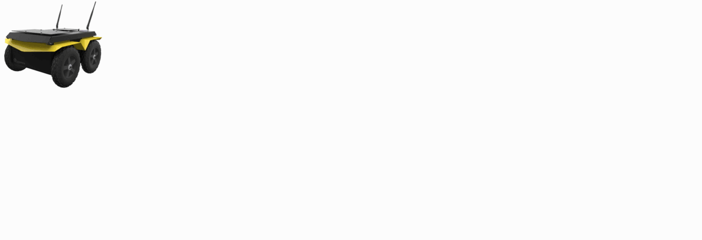
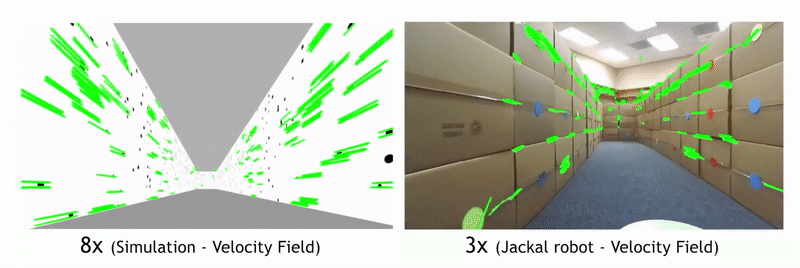
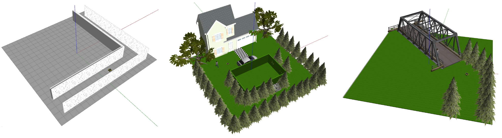
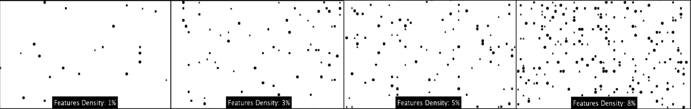

# Visual Navigation Using Sparse Optical Flow and Time-to-Transit

This repository contains code that allows navigation in unknown environments using only a monocular camera. The  work  takes  inspiration  from a  classic  paper  by  Lee  and  Reddish  (Nature,  1981, https://doi.org/10.1038/293293a0) in which they outline a behavioral strategy pursued by diving sea birds based on a visual cue called time-to-contact. The algorithm we introduce here is based on the estimation of a closely related quantity called time-to-transit (TTT).

The main code is represented by three nodes: the `/OpticalFlow node` is  responsible  for  the  Optical Flow (OF) estimation.  It  acquires  a  sequence  of  images  from the  camera  mounted  on  the  robot  and  it  extracts the  relevant  features  to  finally  compute  the  OF vectors. The `/TauComputation node` analyzes the array of keypoints with their velocities packed in the OF message, it computes tau values and it creates input signals for the controller. The `/Controller` selects the right control action to be used depending on the distribution of TTT values and it implements the Sense-Act cycle. For full details see our ICRA2022 paper, available on [arXiv](https://arxiv.org/abs/2111.09669).



## License and attribution

If you use the code in this repository, please cite [our paper](https://arxiv.org/abs/2111.09669). The code is available under the [BSD-2-Clause License](./LICENSE).

```bibtex
@inproceedings{bbzbaillieul2021,
      title={Visual Navigation Using Sparse Optical Flow and Time-to-Transit},
      author={Boretti, Chiara and Bich, Philippe and Zhang, Yanyu and Baillieul, John},
      booktitle={IEEE International Conference on Robotics and Automation},
      year={2022}
}
```
## Prerequisites

- Ubuntu 18.04.
- Clearpath package to simulate Jackal UGV, use the following instruction: `sudo apt-get install ros-<distro>-jackal-simulator ros-<distro>-jackal-desktop ros-<distro>-jackal-navigation`.
- Python 2.7

## Setup and use

Our navigation strategy can be used with any mobile robot equipped with a monocular camera.

First of all, run `optical_flow.py` to obtain the optical flow vectors for a certain number of features in the image (which is divided in three regions, and for every region the most robust features are tracked). The node generates `OpticaFlow.msg` containing position, velocity (px/s) of the features and the time delta (s) between the frames considered (to make real-time computation feasible on different platforms, a choosable but fixed number of frames can be skipped). Run the .py file with an the additional integer parameter 1 (e.g. `rosrun <package> optical_flow.py 1`) if you want to enable a real-time visual representation of the node's output.



Then, it's time to run `tau_computation.py` to obtain the average time-to-transit values for every Region-Of-Interest (ROI). The dimension and the position of those regions can be selected and they can be adapated to the environment in which the robot moves. The number of ROIs in the code presented here is fixed but in principle it can be modified. In this case the controller must be notified of the change and different control laws must be used (stability for Tau Balancing control law with values coming from *n* different ROIs is guaranteed and simple to demonstrate, see [our paper](https://arxiv.org/abs/2111.09669)). The node outputs `TauComputation.msg` used by the controller to select the proper control action. If the number of features in a ROI is not sufficiently high to guarantee a robust TTT estimation, a -1.0 is assigned to the specific region.


Finally, run `controller.py` which will make your robot move at a constant forward speed (by default: 1m/s). The proper steering command will be sent to the robot to align it to the center of the environment and to avoid obstacles. The controller implements the Sense-Act cycle and it is able to choose the right control law depending on the distribution of the time-to-transit values in the image. Tau Balancing based on 2 and 4 ROIs is implemented together with the Single Wall strategy which is a new control action that enables navigation in environments with few and localized features.


Essential parameters for these three nodes are shown below. Other parameters exist and their default values are good for a large amount of environments, but better performances can be achieved by fine-tuning them to adapt the algorithm to the particular environment in which the robot has to move.

### Parameters for `optical_flow.py`

| Parameter            | Description                                                                                                   |    Example Value  |
| -------------------- | ------------------------------------------------------------------------------------------------------------- | :---------------: |
| ~image_sub_name      | name of the Image topic to subscribe.                                                                         | "front/image_raw" |
| ~num_ext_features    | max number of features to be detected in the two outer parts of the image.                                    |        250        |
| ~num_cen_features    | max number of features to be detected in the central part of the image.                                       |        150        |
| ~min_feat_threshold  | minimum % of tracked features that must still be in the image to avoid the reusage of the detector. Parameter must stay in range (0.0-1.0].      |        0.7        |

### Parameters for `tau_computation.py`

| Parameter            | Description                                                                                                   |        Example Value      |
| -------------------- | ------------------------------------------------------------------------------------------------------------- | :-----------------------: |
| ~image_sub_name      | name of Image topic to subscribe to allow visual representation of results of the node. The same used in `optical_flow.py` | "front/image_raw": |
| ~min_TTT_number      | minimum number of features needed to compute the average TTT for each ROI                                     |             10            |
| ~x_init_*ROI*        | x coordinate of the top left corner of ROI                                                                    |              0            |
| ~y_init_*ROI*        | y coordinate of the top left corner of ROI                                                                    |              0            |
| ~x_end_*ROI*         | x coordinate of the bottom right corner of ROI                                                                | int(3\*img_width/12)      |
| ~y_end_*ROI*         | y coordinate of the bottom right corner of ROI                                                                | int(7.5\*img_width/12)    |

where *ROI*={*el*: far left ROI, *er*: far right ROI, *l*: left ROI, *r*: right ROI, *c*: central ROI}

### Parameters for `controller.py`

| Parameter            | Description                                                                                                   |        Example Value      |
| -------------------- | ------------------------------------------------------------------------------------------------------------- | :-----------------------: |
| ~robot_publisher     | name of topic on which the control action generated by the node has to be published.                          | "jackal_velocity_controller/cmd_vel" 
| ~percentage          | percentage of discarded time-to-transit values for each ROI                                                   |             0.25           
| ~max_u               | saturation value for the control input. It depends on the specifics of the selected robot.                    |              1            |

Note that it is also possible to tune the duration of the *Sense* and *Act* cycles.

## Virtual environments
To simulate the behavior of the algorithm in artificial and realistic environments, many scenarios are created in Gazebo. In this repository you will find the code to recreate them in the **GazeboWorlds** folder.  



We also developed patterns to be put on the walls with fixed feature density (Bernoulli distributions of features). The pattern can be created using the `Bernoulli_Textures.py` python scripts in which the density of the features can be set manually. Then the new pattern must be added to the Gazebo materials, the *bernoullixM.png* (where x is the percentage indicating the feature density chosen) generated by the python script has to be saved in `/usr/share/gazebo<y>/media/materials/textures` (where y is the Gazebo version). To use the new material in Gazebo, a *bernoullixM.material* file must be created and saved in `/usr/share/gazebo<y>/media/materials/scripts`. An example of *bernoullixM.material* is:
```
material BernoulliMix/<X>
 {
    technique
    {
       pass
        {
          texture_unit
          {
            texture bernoullixM.png
          }
       }  
    }
 }
 ```
 
 
 ### Launch the Simulation
 1. Launch the file **jackal_world.launch**. It is possible to simulate the desired world by substituting the default world with the desired one in the launch file at this line: 
*arg name="world_name" value="$(find vision_based_navigation_ttt)/GazeboWorlds/<desired .world file>"/*. 
The jackal robot model has a lot of different sensors but for our purposes the only needed is the monocular camera. The robot model, with the monocular camera mounted on it, can be obtained in the simulation environment by using the following command: `roslaunch vision_based_navigation_ttt jackal_world.launch config:=front_flea3`.
 2. Run the **optical_flow.py**, **tau_computation.py** and the **controller.py** nodes by using the following command: `rosrun vision_based_navigation_ttt <name of the node>`.
      
 ### Known Issues with ROS Noetic and Ubuntu 20.04:

Because ROS Noetic mainly features Python 3, which is a major shift from Python 2 in ROS Melodic and Ubuntu 18.04, there may be a problem related to Python 3 not tolerating mixing of tabs and spaces in Python source code.  Errors of the following form may occur:

`-->TabError: inconsistent use of tabs and spaces in indentation`
      
We are working on a solution to guarantee full support for ROS Noetic.
